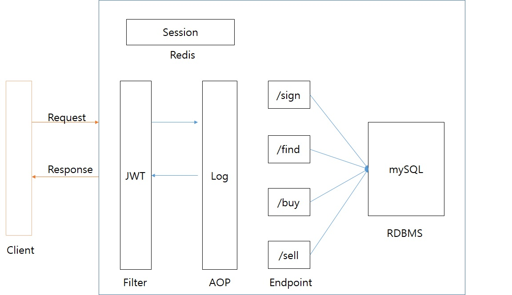

# Project
본 프로젝트는 Spring Boot 기반의 어플리케이션이고, 웹 기반의 주식 자동 매매 알림서비스이다.
 기본적으로 http 프로토콜로 접근이 가능한 REST API를 통해 데이터 조작을 지원한다.
 > 필요하거나 하고싶은 기술을 제의할 수 있다.

## 1. 기능
- 회원
  - 회원가입(휴대전화번호 필수)
  - 인증(로그인, 로그아웃)
    > Oauth 인증을 활용하면 좋을듯 
  - 패스워드 찾기(메일로 임시 비밀번호 전달)

- API(키움증권 OPEN API 사용)
  - 주식 현재 시세 API 연동
  - 종목 검색 기능
  - 매수 - 사용자가 입력한 매수가 +-n%에 도달 시 단계별 알림 발송
  - 매도 - 사용자가 입력한 매도가 +n% 에 도달 시 단계별 알림 발송
    cf) 무료 주식 자동 분석 시스템 : 사한만호

## 2. 기술
- 스프링부트
- DB : MySQL
- React or Vue
- Java 8
- gradle
- JPA(Hibernate)
- Redis
- git, github
- JUnit
- AWS

## 3. Serivce Flow 

- Filter는 Spring Security를 활용하여 JWT을 검증한다 (JWT 인증은 Post일때만 사용한다.)
- Redis에서 회원 세션 정보를 사용한다.
- AWS EC2 서버 활용예정 (App, DB, Redis 모두 하나의 서버로 관리)

## 4. 개발환경 설정 방법
- 작성중

## 5. 커밋 메시지 작성 가이드
- 커밋 메시지 앞 부분에 이슈 번호를 기록할 것. 깃헙에서 자동으로 이슈 링크가 걸리기 때문에 어떤 이슈에 대한 커밋인지 찾기가 쉽다.
    - ex) [#4] 회원 로그인 개발     
- 커밋의 본문을 적을때는 제목과 한 줄 띄워 적는다. 커밋 로그 가독성이 높아진다.

## 6. 기간
- 2021.03.21 ~ 2021.05.31
  * [회의록]은 Slack 채널을 활용
- 3월 21일 : 1차 회의 예정

## 7. 주의사항
* 프로젝트는 테스트 실행시 active profile을 ```local```로 두었는데, 다른 profile로 active 가능하다.
* 본 프로젝트는 2021년 상반기에 끝낼 목적으로 시작하고, 중도포기는 없다.

```java
@ExtendWith(SpringExtension.class)
@SpringBootTest
public class ParameterStorePropertiesTest {

    @Autowired
    private ParameterStoreProperties properties;

    @Test
    void local_파라미터를_가져온다()   {
        assertThat(properties.getEncryptKey()).isEqualTo(dabin_local");
    }
}
```